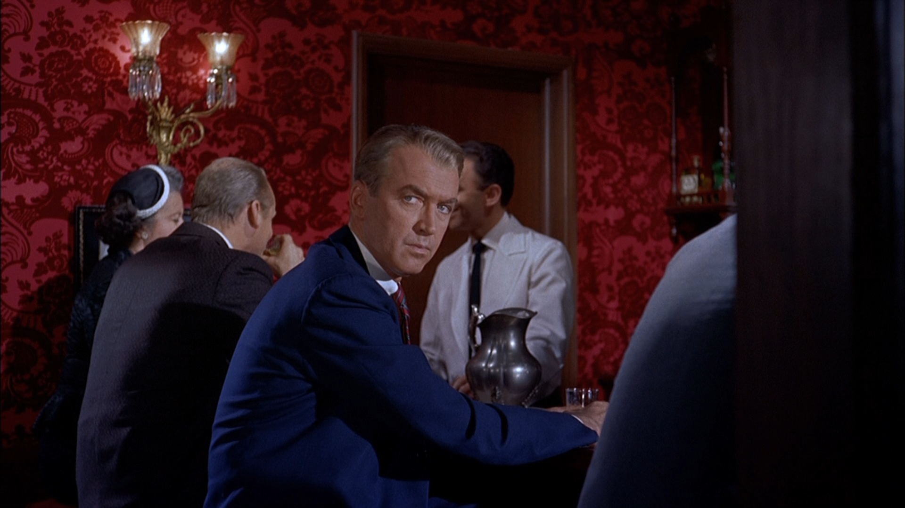

---
output:
  md_document:
    variant: markdown_github
---

<!-- README.md is generated from README.Rmd. Please edit that file -->

```{r, echo = FALSE}
knitr::opts_chunk$set(
  collapse = TRUE,
  comment = "#>",
  fig.path = "figure/",
  fig.height = 1
)
```

# Film Palettes

## Installation

```R
devtools::install_github("nowosad/filmcolors")
```

## Usage

```{r, pal_one}
library('filmcolors')

# See all palettes
names(film_palettes)
```

### Vertigo (1958)

```{r, echo=FALSE}
library('knitr')

```

```{r, Vertigo}
film_colors("Vertigo")
```

```{r Vertigo_gg2, fig.height=3.5}
library('ggplot2')
ggplot(mtcars, aes(mpg, hp, color=as.factor(carb))) +  geom_point(size=8) +
  scale_color_manual(values = film_colors("Vertigo"))
```

### `sort_colors` function

```{r, sort_colors}
colors <- c("#060306", "#290705", "#131325")
class(colors) <- 'palette'
colors
sorted_colors <- sort_colors(colors)
sorted_colors
```

## Credits

- https://github.com/woobe/rPlotter
- https://github.com/karthik/wesanderson
- https://learnr.wordpress.com/2010/01/21/ggplot2-crayola-crayon-colours/
- https://twitter.com/CINEMAPALETTES