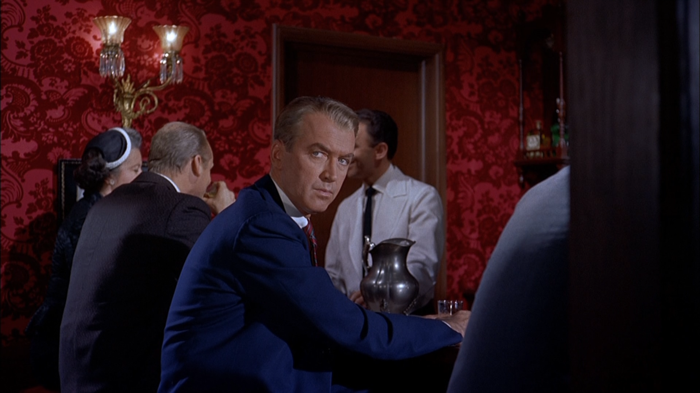
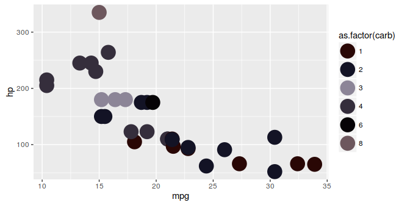

<!-- README.md is generated from README.Rmd. Please edit that file -->
Film Palettes
=============

[](https://travis-ci.org/Nowosad/filmcolors)

Installation
------------

``` r
devtools::install_github("nowosad/filmcolors")
```

Usage
-----

``` r
library('filmcolors')

# See all palettes
names(film_palettes)
#> [1] "Vertigo"
```

### Vertigo (1958)



``` r
film_colors("Vertigo")
```


``` r
library('ggplot2')
ggplot(mtcars, aes(mpg, hp, color=as.factor(carb))) +  geom_point(size=8) +
  scale_color_manual(values = film_colors("Vertigo"))
```



### `sort_colors` function

``` r
colors <- c("#060306", "#290705", "#131325")
class(colors) <- 'palette'
colors
```


``` r
sorted_colors <- sort_colors(colors)
sorted_colors
```


Credits
-------

-   <https://github.com/woobe/rPlotter>
-   <https://github.com/karthik/wesanderson>
-   <https://learnr.wordpress.com/2010/01/21/ggplot2-crayola-crayon-colours/>
-   <https://twitter.com/CINEMAPALETTES>
